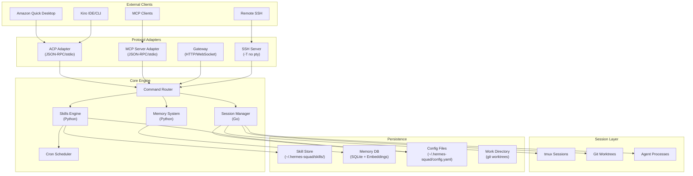
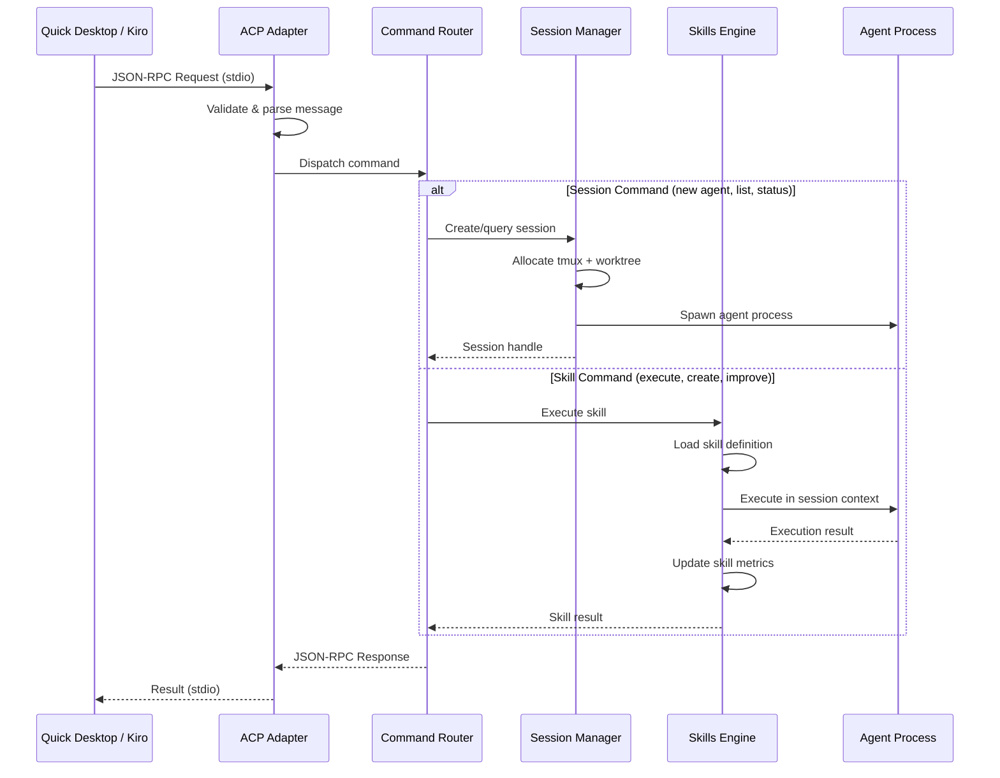
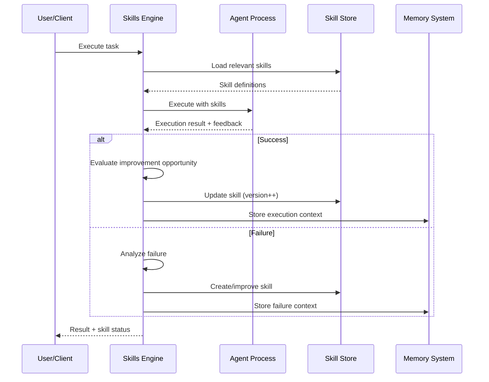
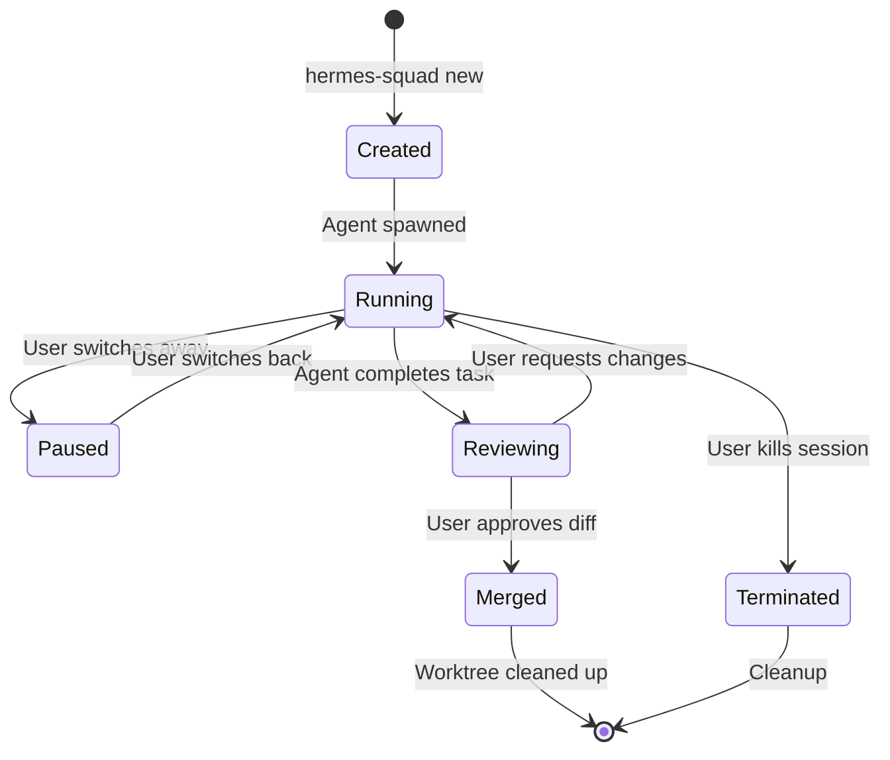

# Architecture

> Complete system architecture for Hermes Squad — the unified multi-agent terminal manager with self-improving AI capabilities.

---

## High-Level Architecture

```
┌─────────────────────────────────────────────────────────────────────────────────┐
│                              External Integrations                                │
│                                                                                   │
│  ┌──────────────────┐   ┌──────────────────┐   ┌──────────────────────────────┐ │
│  │  Amazon Quick    │   │    Kiro IDE/CLI   │   │   Other MCP Clients          │ │
│  │  Desktop         │   │                   │   │   (VS Code, custom)          │ │
│  │  ┌────────────┐  │   │  ┌────────────┐  │   │  ┌────────────┐             │ │
│  │  │ ACP Client │  │   │  │ ACP Client │  │   │  │ MCP Client │             │ │
│  │  └─────┬──────┘  │   │  └─────┬──────┘  │   │  └─────┬──────┘             │ │
│  └────────┼──────────┘   └────────┼──────────┘   └────────┼──────────────────┘ │
│           │ JSON-RPC/stdio        │ JSON-RPC/stdio         │ JSON-RPC/stdio      │
└───────────┼───────────────────────┼───────────────────────┼─────────────────────┘
            │                       │                       │
            ▼                       ▼                       ▼
┌─────────────────────────────────────────────────────────────────────────────────┐
│                           Hermes Squad Core                                       │
│                                                                                   │
│  ┌─────────────────────────────────────────────────────────────────────────────┐ │
│  │                        Protocol Adapters Layer                               │ │
│  │                                                                              │ │
│  │  ┌─────────────────┐  ┌─────────────────┐  ┌─────────────────────────────┐ │ │
│  │  │  ACP Adapter    │  │  MCP Adapter    │  │  Gateway (HTTP/WS)          │ │ │
│  │  │  (JSON-RPC      │  │  (JSON-RPC      │  │  (REST API + WebSocket)     │ │ │
│  │  │   over stdio)   │  │   over stdio)   │  │                             │ │ │
│  │  └────────┬────────┘  └────────┬────────┘  └─────────────┬───────────────┘ │ │
│  └───────────┼─────────────────────┼─────────────────────────┼─────────────────┘ │
│              │                     │                         │                    │
│              ▼                     ▼                         ▼                    │
│  ┌─────────────────────────────────────────────────────────────────────────────┐ │
│  │                         Command Router                                       │ │
│  │         (dispatches requests to appropriate subsystem)                       │ │
│  └────────────┬──────────────────┬──────────────────────┬──────────────────────┘ │
│               │                  │                      │                        │
│    ┌──────────▼────────┐  ┌──────▼──────────┐  ┌───────▼──────────┐            │
│    │  Session Manager  │  │  Skills Engine  │  │  Memory System   │            │
│    │  (Go)             │  │  (Python)       │  │  (Python)        │            │
│    │                   │  │                 │  │                  │            │
│    │ • tmux sessions   │  │ • Skill CRUD   │  │ • Knowledge graph│            │
│    │ • git worktrees   │  │ • Improvement  │  │ • Episodic memory│            │
│    │ • agent lifecycle │  │ • Skill store  │  │ • Context window │            │
│    │ • diff management │  │ • Execution    │  │ • Embeddings     │            │
│    │ • auto-accept     │  │ • Cron jobs    │  │                  │            │
│    └──────────┬────────┘  └────────┬────────┘  └────────┬─────────┘            │
│               │                    │                     │                       │
│    ┌──────────▼────────────────────▼─────────────────────▼──────────────────┐   │
│    │                     Shared Infrastructure                                │   │
│    │                                                                          │   │
│    │  ┌─────────────┐  ┌─────────────┐  ┌──────────────┐  ┌──────────────┐ │   │
│    │  │   Config    │  │   Logger    │  │   Event Bus  │  │  File System │ │   │
│    │  │   Manager   │  │             │  │   (pub/sub)  │  │   Watcher    │ │   │
│    │  └─────────────┘  └─────────────┘  └──────────────┘  └──────────────┘ │   │
│    └──────────────────────────────────────────────────────────────────────────┘   │
│                                                                                   │
│  ┌─────────────────────────────────────────────────────────────────────────────┐ │
│  │                              TUI Layer (Go)                                  │ │
│  │                                                                              │ │
│  │  ┌──────────┐  ┌──────────┐  ┌──────────┐  ┌──────────┐  ┌──────────────┐│ │
│  │  │  Status  │  │  Session │  │   Diff   │  │   Skill  │  │    Config    ││ │
│  │  │  Panel   │  │  List    │  │  Preview │  │  Browser │  │    Editor   ││ │
│  │  └──────────┘  └──────────┘  └──────────┘  └──────────┘  └──────────────┘│ │
│  └─────────────────────────────────────────────────────────────────────────────┘ │
└─────────────────────────────────────────────────────────────────────────────────┘
```

---

## Component Architecture (Mermaid)



---

## Data Flow

### 1. ACP Request Flow (Amazon Quick / Kiro)



### 2. Skill Improvement Loop



### 3. Session Lifecycle



---

## Component Details

### Session Manager (Go)

The Session Manager is the core orchestrator inherited from Claude Squad. It manages:

| Responsibility | Implementation |
|---------------|---------------|
| tmux sessions | `pkg/session/tmux.go` — Create, attach, detach, kill |
| Git worktrees | `pkg/session/worktree.go` — Create, switch, merge, cleanup |
| Agent lifecycle | `pkg/session/agent.go` — Spawn, monitor, restart |
| Auto-accept | `pkg/session/autoaccept.go` — File watcher + approval logic |
| Diff management | `pkg/session/diff.go` — Generate, display, apply |

```go
// Core session interface
type Session interface {
    ID() string
    Status() SessionStatus
    Agent() AgentProcess
    Worktree() *git.Worktree
    TmuxPane() *tmux.Pane
    Skills() []Skill
    Start(ctx context.Context) error
    Pause() error
    Resume() error
    Terminate() error
}
```

### Skills Engine (Python)

The Skills Engine is inherited from Hermes Agent. It provides:

| Responsibility | Implementation |
|---------------|---------------|
| Skill CRUD | `agent/skills/manager.py` — Create, read, update, delete |
| Execution | `agent/skills/executor.py` — Run skills in sandboxed context |
| Improvement | `agent/skills/improver.py` — Analyze and refine skills |
| Persistence | `agent/skills/store.py` — File-based skill storage |
| Cron | `agent/skills/cron.py` — Scheduled skill execution |

```python
# Core skill interface
class Skill:
    name: str
    version: int
    description: str
    instructions: str
    triggers: list[Trigger]
    metrics: SkillMetrics

    async def execute(self, context: ExecutionContext) -> SkillResult:
        ...

    async def improve(self, feedback: Feedback) -> 'Skill':
        ...
```

### Memory System (Python)

The Memory System provides cross-session persistence:

| Component | Purpose |
|-----------|---------|
| Knowledge Graph | Entity relationships, facts, structured knowledge |
| Episodic Memory | Past interactions, outcomes, context |
| Embedding Store | Semantic search over memories |
| Context Builder | Assembles relevant context for agent prompts |

### Protocol Adapters

#### ACP Adapter (Agent Client Protocol)

- **Transport**: JSON-RPC 2.0 over stdio
- **Registration**: "Coding Agents" in Quick Settings > Capabilities > MCP
- **Capabilities**: Task execution, session management, skill invocation
- **Auth**: Inherited from parent process (Quick/Kiro manages auth)

#### MCP Adapter (Model Context Protocol)

- **Transport**: JSON-RPC 2.0 over stdio
- **Tools exposed**: Session management, skill execution, memory queries
- **Resources**: Skill definitions, session states, diffs
- **Prompts**: Pre-built prompt templates for common tasks

#### Gateway (HTTP/WebSocket)

- **REST API**: Full CRUD for sessions, skills, config
- **WebSocket**: Real-time session output streaming
- **Auth**: Token-based (configurable)
- **Port**: Default 8765 (configurable)

---

## Directory Structure

```
hermes-squad/
├── cmd/                        # Go entrypoints
│   ├── hermes-squad/           # Main binary
│   └── hs-agent/              # Agent subprocess
├── pkg/                        # Go packages
│   ├── session/               # Session management
│   │   ├── tmux.go
│   │   ├── worktree.go
│   │   ├── agent.go
│   │   └── diff.go
│   ├── tui/                   # Terminal UI (Bubble Tea)
│   │   ├── app.go
│   │   ├── views/
│   │   └── components/
│   ├── protocol/              # Protocol adapters
│   │   ├── acp/
│   │   ├── mcp/
│   │   └── gateway/
│   └── config/                # Configuration
├── agent/                      # Python agent/skills
│   ├── skills/                # Skills engine
│   │   ├── manager.py
│   │   ├── executor.py
│   │   ├── improver.py
│   │   ├── store.py
│   │   └── cron.py
│   ├── memory/                # Memory system
│   │   ├── graph.py
│   │   ├── episodic.py
│   │   └── embeddings.py
│   └── gateway/               # HTTP/WS gateway
├── ts/                         # TypeScript components
│   └── mcp-server/           # MCP server implementation
├── docs/                       # Documentation (you are here)
├── configs/                    # Default configurations
├── scripts/                    # Build & utility scripts
├── Makefile
├── go.mod
├── pyproject.toml
└── package.json
```

---

## Technology Stack

| Layer | Technology | Purpose |
|-------|-----------|---------|
| TUI | Go + Bubble Tea | Terminal user interface |
| Session Mgmt | Go + tmux + git | Process orchestration |
| Skills Engine | Python 3.11+ | Skill execution & improvement |
| Memory | Python + SQLite + FAISS | Persistent knowledge |
| Protocol | Go + Python | ACP/MCP/Gateway adapters |
| TypeScript | Node.js 20+ | MCP server, optional components |
| Build | Make + Go + pip | Build orchestration |

---

## Inter-Process Communication

The Go and Python components communicate via:

1. **Unix Domain Sockets** — Primary IPC for session ↔ skills engine
2. **Shared filesystem** — Skill definitions, memory DB, config
3. **Event bus** — Internal pub/sub for cross-component notifications

```
┌────────────────┐         UDS          ┌────────────────┐
│   Go Process   │◄────────────────────►│ Python Process │
│  (TUI + Sess.) │                      │ (Skills + Mem) │
└───────┬────────┘                      └───────┬────────┘
        │                                       │
        │         Shared Filesystem             │
        └──────────────┐    ┌───────────────────┘
                       │    │
                       ▼    ▼
              ~/.hermes-squad/
              ├── skills/
              ├── memory/
              ├── config.yaml
              └── sessions/
```

---

## Security Model

| Boundary | Protection |
|----------|-----------|
| Agent sandboxing | Each agent runs in isolated worktree with limited filesystem access |
| Auto-accept | Configurable file patterns, command allowlists |
| ACP/MCP | Stdio isolation — no network exposure by default |
| Gateway | Token auth, configurable CORS, rate limiting |
| Skills | Skill execution sandboxed, no arbitrary code unless explicitly allowed |
| Memory | Local-only by default, encrypted at rest option |

---

## See Also

- [Integration Guide](INTEGRATION-GUIDE.md) — How to connect to Quick/Kiro
- [Skills System](SKILLS-SYSTEM.md) — Deep dive into the skills engine
- [Session Management](SESSION-MANAGEMENT.md) — Session lifecycle details
- [Configuration](CONFIGURATION.md) — All configuration options
