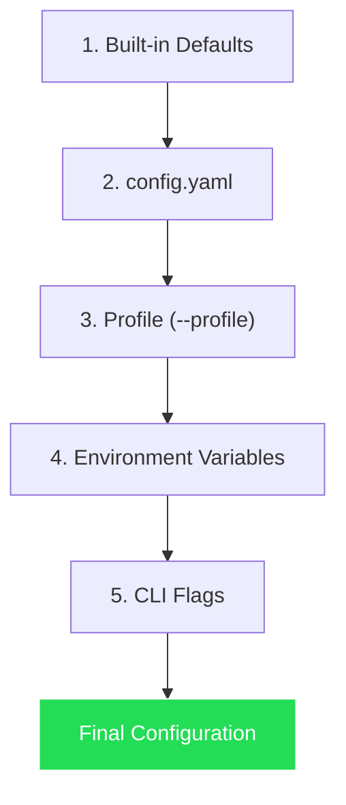

# Configuration

> Complete reference for all Hermes Squad configuration options, profiles, and environment variables.

---

## Table of Contents

- [Configuration Files](#configuration-files)
- [Config File Reference](#config-file-reference)
- [Profiles](#profiles)
- [Environment Variables](#environment-variables)
- [CLI Flags](#cli-flags)
- [Precedence Order](#precedence-order)
- [Examples](#examples)

---

## Configuration Files

Hermes Squad uses a layered configuration system:

```
~/.hermes-squad/
├── config.yaml              # Main configuration
├── profiles/
│   ├── default.yaml         # Default profile
│   ├── quick.yaml           # Amazon Quick Desktop profile
│   ├── kiro.yaml            # Kiro IDE profile
│   └── remote.yaml          # Remote SSH profile
├── skills/                  # Skill store (see SKILLS-SYSTEM.md)
├── memory/                  # Memory database
├── sessions/                # Session metadata
├── logs/                    # Log files
│   ├── hermes-squad.log
│   ├── acp.log
│   ├── mcp.log
│   └── skills.log
└── cron.yaml                # Cron job definitions
```

---

## Config File Reference

### Complete `config.yaml`

```yaml
# ~/.hermes-squad/config.yaml
# Full configuration reference for Hermes Squad

# ─────────────────────────────────────────────────────────────────
# General Settings
# ─────────────────────────────────────────────────────────────────
general:
  # Application name (used in tmux session names, logs)
  name: "hermes-squad"

  # Default profile to use when none specified
  default_profile: "default"

  # Log level: trace | debug | info | warn | error
  log_level: "info"

  # Log format: text | json
  log_format: "text"

  # Log output: stdout | stderr | file
  log_output: "file"

  # Log file path (relative to ~/.hermes-squad/)
  log_file: "logs/hermes-squad.log"

  # Maximum log file size before rotation (MB)
  log_max_size: 50

  # Number of rotated log files to keep
  log_max_backups: 5

  # Telemetry (anonymous usage statistics)
  telemetry:
    enabled: false
    endpoint: ""

# ─────────────────────────────────────────────────────────────────
# Session Management
# ─────────────────────────────────────────────────────────────────
session:
  # Maximum concurrent sessions
  max_sessions: 10

  # Default session timeout (0 = no timeout)
  timeout: "0"

  # Auto-cleanup completed sessions after this duration
  cleanup_after: "24h"

  # Git worktree settings
  worktree:
    # Enable git worktree isolation
    enabled: true
    # Directory for worktrees (relative to repo root)
    directory: ".worktrees"
    # Branch prefix for worktree branches
    prefix: "hs/"
    # Auto-cleanup worktree on session termination
    cleanup_on_terminate: true
    # Base branch for new worktrees (or "HEAD")
    base_branch: "main"
    # Maximum concurrent worktrees per repository
    max_worktrees: 10
    # Stash uncommitted changes before creating worktree
    stash_before_create: true

  # Tmux settings
  tmux:
    # Tmux socket name
    socket: "hermes-squad"
    # Pane history limit (lines)
    history_limit: 10000
    # Capture pane output for analysis
    capture_output: true
    # Shell for agent processes
    shell: "/bin/bash"
    # Tmux configuration overrides
    options:
      mouse: "on"
      status: "off"

  # Auto-accept settings
  auto_accept:
    # Enable auto-accept by default for new sessions
    enabled: false
    # File patterns that can be auto-accepted
    allowed_patterns:
      - "*.py"
      - "*.ts"
      - "*.tsx"
      - "*.js"
      - "*.jsx"
      - "*.go"
      - "*.rs"
      - "*.md"
      - "*.yaml"
      - "*.yml"
      - "*.json"
      - "*.toml"
      - "*.cfg"
      - "*.txt"
      - "tests/**"
      - "test/**"
      - "spec/**"
    # Files requiring manual approval (overrides allowed)
    protected_patterns:
      - "*.env"
      - "*.env.*"
      - "*.secret"
      - "*.key"
      - "*.pem"
      - "**/secrets/**"
      - "**/credentials/**"
      - "Makefile"
      - "Dockerfile"
      - "docker-compose*.yaml"
      - ".github/workflows/*"
      - ".gitlab-ci.yml"
      - "package.json"
      - "go.mod"
      - "Cargo.toml"
      - "requirements.txt"
      - "pyproject.toml"
    # Command execution rules
    commands:
      allowed:
        - "go test ./..."
        - "go build ./..."
        - "pytest *"
        - "python -m pytest *"
        - "npm test"
        - "npm run test*"
        - "cargo test"
        - "make test"
        - "git diff *"
        - "git status"
        - "git log *"
        - "cat *"
        - "head *"
        - "tail *"
        - "wc *"
        - "find *"
        - "grep *"
        - "rg *"
      blocked:
        - "rm -rf *"
        - "sudo *"
        - "curl * | *sh"
        - "wget * | *sh"
        - "chmod 777 *"
        - "dd *"
        - "> /dev/*"
    # Limits
    max_files_per_action: 10
    max_lines_per_file: 500
    require_tests: false

  # Coordination settings (multi-agent)
  coordination:
    # Conflict resolution strategy
    conflict_strategy: "manual"  # first-wins | last-wins | manual
    # Enable inter-session messaging
    message_passing: true
    # Enable skill sharing notifications
    skill_notifications: true

# ─────────────────────────────────────────────────────────────────
# Skills Engine
# ─────────────────────────────────────────────────────────────────
skills:
  # Enable the skills system
  enabled: true

  # Skill store directory
  store_path: "~/.hermes-squad/skills"

  # Auto-extract skills from successful executions
  auto_extract: true

  # Auto-improve skills on failure
  auto_improve: true

  # Share skills across sessions
  share_across_sessions: true

  # Share skills across profiles
  cross_profile: false

  # Improvement settings
  improvement:
    # Enable automatic improvement
    enabled: true
    # Minimum executions before improvement activates
    min_executions: 3
    # Success rate threshold triggering review
    review_threshold: 0.7
    # Maximum auto-generated versions
    max_auto_versions: 10
    # Improvement aggressiveness
    aggressiveness: "moderate"  # conservative | moderate | aggressive

  # Skill retrieval settings
  retrieval:
    # Maximum skills loaded per task
    max_skills_per_task: 3
    # Minimum similarity score for semantic matching
    min_similarity: 0.75
    # Enable pattern-based matching
    pattern_matching: true
    # Enable semantic (embedding) matching
    semantic_matching: true
    # Enable file-pattern matching
    file_pattern_matching: true

  # Community skill store
  store:
    enabled: true
    registry_url: "https://skills.hermes-squad.dev/api"
    auto_update: false
    update_interval: "7d"

# ─────────────────────────────────────────────────────────────────
# Memory System
# ─────────────────────────────────────────────────────────────────
memory:
  # Enable persistent memory
  enabled: true

  # Memory database path
  db_path: "~/.hermes-squad/memory/memory.db"

  # Embedding model for semantic search
  embedding_model: "all-MiniLM-L6-v2"

  # Maximum memories to retrieve per query
  max_retrieval: 10

  # Memory retention period (0 = forever)
  retention: "0"

  # Prune low-relevance memories automatically
  auto_prune: true
  prune_threshold: 0.3

  # Encryption at rest
  encrypt: false
  # encryption_key sourced from env: HERMES_SQUAD_MEMORY_KEY

# ─────────────────────────────────────────────────────────────────
# ACP (Agent Client Protocol) Settings
# ─────────────────────────────────────────────────────────────────
acp:
  # Enable ACP adapter
  enabled: true

  # Capabilities to advertise
  capabilities:
    - tasks
    - sessions
    - skills
    - streaming
    - memory

  # Maximum concurrent ACP tasks
  max_concurrent_tasks: 5

  # Task timeout
  task_timeout: "30m"

  # Streaming progress interval
  progress_interval: "2s"

  # IDE integration features
  ide_integration:
    auto_open_diff: true
    inline_suggestions: false
    context_from_ide: true

# ─────────────────────────────────────────────────────────────────
# MCP (Model Context Protocol) Settings
# ─────────────────────────────────────────────────────────────────
mcp:
  # Enable MCP adapter
  enabled: true

  # Tools to expose
  tools:
    - session_create
    - session_list
    - session_status
    - session_terminate
    - skill_execute
    - skill_list
    - skill_create
    - memory_query
    - memory_store
    - diff_preview
    - diff_apply

  # Resources to expose
  resources:
    - skills
    - sessions
    - memory

  # Prompt templates
  prompts:
    enabled: true
    directory: "~/.hermes-squad/prompts/"

# ─────────────────────────────────────────────────────────────────
# Gateway (HTTP/WebSocket) Settings
# ─────────────────────────────────────────────────────────────────
gateway:
  # Enable HTTP/WebSocket gateway
  enabled: false

  # Listen address
  host: "127.0.0.1"
  port: 8765

  # Authentication
  auth:
    enabled: true
    type: "token"  # token | basic | none
    # Token sourced from env: HERMES_SQUAD_GATEWAY_TOKEN
    token_header: "X-Auth-Token"

  # CORS settings
  cors:
    enabled: false
    allowed_origins: ["http://localhost:*"]
    allowed_methods: ["GET", "POST", "PUT", "DELETE"]

  # Rate limiting
  rate_limit:
    enabled: true
    requests_per_minute: 60
    burst: 10

  # WebSocket settings
  websocket:
    ping_interval: "30s"
    max_message_size: "1MB"

# ─────────────────────────────────────────────────────────────────
# Agent Settings
# ─────────────────────────────────────────────────────────────────
agent:
  # Default AI model
  default_model: "claude-sonnet-4"

  # Model provider
  provider: "anthropic"  # anthropic | openai | bedrock | local

  # API key (prefer env var: ANTHROPIC_API_KEY)
  # api_key: ""

  # Maximum tokens per response
  max_tokens: 8192

  # Temperature
  temperature: 0.1

  # System prompt additions (appended to default)
  system_prompt_suffix: ""

  # Tool use settings
  tool_use:
    enabled: true
    # Allowed tool categories
    categories:
      - filesystem
      - git
      - terminal
      - search

  # Provider-specific settings
  providers:
    anthropic:
      api_url: "https://api.anthropic.com"
      model_prefix: "claude-"
    openai:
      api_url: "https://api.openai.com/v1"
    bedrock:
      region: "us-east-1"
      profile: "default"
    local:
      api_url: "http://localhost:11434"
      model: "codestral"

# ─────────────────────────────────────────────────────────────────
# TUI Settings
# ─────────────────────────────────────────────────────────────────
tui:
  # Color scheme
  theme: "dark"  # dark | light | auto

  # Refresh interval for session status
  refresh_interval: "1s"

  # Show session metrics in sidebar
  show_metrics: true

  # Default panel focus
  default_panel: "sessions"  # sessions | output | diff

  # Key binding overrides (vim-style by default)
  keybindings:
    new_session: "n"
    view_diff: "d"
    toggle_auto_accept: "a"
    kill_session: "k"
    pause_session: "p"
    skills_browser: "s"
    memory_viewer: "m"
    config_editor: "c"
    help: "?"
    quit: "q"
```

---

## Profiles

Profiles allow different configurations for different use cases. They override the base `config.yaml`.

### Profile Loading

```bash
# Use a specific profile
hermes-squad --profile quick

# Or via environment variable
HERMES_SQUAD_PROFILE=kiro hermes-squad
```

### Built-in Profiles

#### `default.yaml`

```yaml
# ~/.hermes-squad/profiles/default.yaml
name: default
description: "Default profile for local development"

session:
  auto_accept:
    enabled: false
  max_sessions: 5

skills:
  auto_improve: true
```

#### `quick.yaml`

```yaml
# ~/.hermes-squad/profiles/quick.yaml
name: quick
description: "Optimized for Amazon Quick Desktop integration"

acp:
  enabled: true
  max_concurrent_tasks: 5
  capabilities:
    - tasks
    - sessions
    - skills
    - streaming

session:
  auto_accept:
    enabled: true
  worktree:
    cleanup_on_terminate: true

skills:
  auto_extract: true
  auto_improve: true
  share_across_sessions: true

# Disable TUI (Quick manages the UI)
tui:
  enabled: false
```

#### `kiro.yaml`

```yaml
# ~/.hermes-squad/profiles/kiro.yaml
name: kiro
description: "Optimized for Kiro IDE integration"

acp:
  enabled: true
  ide_integration:
    auto_open_diff: true
    inline_suggestions: true
    context_from_ide: true

session:
  worktree:
    prefix: "hs-kiro/"
  auto_accept:
    enabled: true
    require_tests: true

skills:
  context_from_ide: true
```

#### `remote.yaml`

```yaml
# ~/.hermes-squad/profiles/remote.yaml
name: remote
description: "Profile for remote SSH usage"

general:
  log_output: "file"
  log_level: "info"

# Disable TUI for headless operation
tui:
  enabled: false

# Enable gateway for remote monitoring
gateway:
  enabled: true
  host: "0.0.0.0"
  port: 8765
  auth:
    enabled: true
    type: "token"

session:
  tmux:
    socket: "hermes-squad-remote"
  auto_accept:
    enabled: true
```

### Custom Profile

Create your own:

```bash
# Create from template
hermes-squad profile create my-profile --from default

# Edit
hermes-squad profile edit my-profile

# List profiles
hermes-squad profile list

# Set as default
hermes-squad profile set-default my-profile
```

---

## Environment Variables

All configuration values can be overridden via environment variables using the pattern:
`HERMES_SQUAD_<SECTION>_<KEY>` (uppercase, underscores).

### Core Variables

| Variable | Default | Description |
|----------|---------|-------------|
| `HERMES_SQUAD_PROFILE` | `default` | Active profile name |
| `HERMES_SQUAD_CONFIG_DIR` | `~/.hermes-squad` | Config directory path |
| `HERMES_SQUAD_LOG_LEVEL` | `info` | Log level override |
| `HERMES_SQUAD_LOG_FORMAT` | `text` | Log format (text/json) |

### API Keys

| Variable | Description |
|----------|-------------|
| `ANTHROPIC_API_KEY` | Anthropic API key for Claude models |
| `OPENAI_API_KEY` | OpenAI API key |
| `AWS_PROFILE` | AWS profile for Bedrock |
| `AWS_REGION` | AWS region for Bedrock |

### Security

| Variable | Description |
|----------|-------------|
| `HERMES_SQUAD_GATEWAY_TOKEN` | Gateway auth token |
| `HERMES_SQUAD_MEMORY_KEY` | Memory encryption key |

### Session

| Variable | Default | Description |
|----------|---------|-------------|
| `HERMES_SQUAD_MAX_SESSIONS` | `10` | Max concurrent sessions |
| `HERMES_SQUAD_WORKTREE_DIR` | `.worktrees` | Worktree directory |
| `HERMES_SQUAD_TMUX_SOCKET` | `hermes-squad` | Tmux socket name |

### ACP/MCP

| Variable | Default | Description |
|----------|---------|-------------|
| `HERMES_SQUAD_ACP_ENABLED` | `true` | Enable ACP adapter |
| `HERMES_SQUAD_MCP_ENABLED` | `true` | Enable MCP adapter |
| `HERMES_SQUAD_GATEWAY_ENABLED` | `false` | Enable HTTP gateway |
| `HERMES_SQUAD_GATEWAY_PORT` | `8765` | Gateway port |

### Agent

| Variable | Default | Description |
|----------|---------|-------------|
| `HERMES_SQUAD_AGENT_MODEL` | `claude-sonnet-4` | Default model |
| `HERMES_SQUAD_AGENT_PROVIDER` | `anthropic` | Model provider |
| `HERMES_SQUAD_AGENT_MAX_TOKENS` | `8192` | Max tokens per response |
| `HERMES_SQUAD_AGENT_TEMPERATURE` | `0.1` | Temperature |

---

## CLI Flags

CLI flags override all other configuration:

```bash
hermes-squad [global-flags] <command> [command-flags]
```

### Global Flags

| Flag | Short | Description |
|------|-------|-------------|
| `--config` | `-c` | Path to config file |
| `--profile` | `-p` | Profile to use |
| `--log-level` | | Override log level |
| `--verbose` | `-v` | Enable debug logging |
| `--quiet` | `-q` | Suppress all output except errors |

### Serve Flags

| Flag | Description |
|------|-------------|
| `--acp` | Start in ACP mode |
| `--mcp` | Start in MCP mode |
| `--gateway` | Start HTTP/WS gateway |
| `--port` | Gateway port |
| `--host` | Gateway host |

### Session Flags

| Flag | Description |
|------|-------------|
| `--name` | Session name |
| `--task` | Task description |
| `--workspace` | Working directory |
| `--auto-accept` | Enable auto-accept |
| `--model` | AI model override |
| `--no-worktree` | Disable worktree isolation |

---

## Precedence Order

Configuration is applied in this order (later overrides earlier):

```
1. Built-in defaults
2. ~/.hermes-squad/config.yaml
3. Profile file (e.g., profiles/quick.yaml)
4. Environment variables (HERMES_SQUAD_*)
5. CLI flags
```



---

## Examples

### Minimal Configuration (Quick Start)

```yaml
# ~/.hermes-squad/config.yaml
agent:
  default_model: "claude-sonnet-4"

session:
  auto_accept:
    enabled: true
```

### Security-Focused Configuration

```yaml
general:
  log_level: "warn"

session:
  auto_accept:
    enabled: false
  worktree:
    enabled: true

memory:
  encrypt: true

gateway:
  enabled: false

agent:
  tool_use:
    categories:
      - filesystem
      - git
      # terminal and search disabled
```

### High-Performance Configuration

```yaml
session:
  max_sessions: 20
  auto_accept:
    enabled: true
    max_files_per_action: 25
  worktree:
    max_worktrees: 20

skills:
  improvement:
    aggressiveness: "aggressive"
    min_executions: 1

agent:
  max_tokens: 16384
  temperature: 0.0
```

### CI/CD Configuration

```yaml
general:
  log_level: "info"
  log_output: "stdout"
  log_format: "json"

tui:
  enabled: false

session:
  auto_accept:
    enabled: true
  worktree:
    cleanup_on_terminate: true

gateway:
  enabled: false

agent:
  default_model: "claude-sonnet-4"
  temperature: 0.0
```

---

## Validating Configuration

```bash
# Validate current config
hermes-squad config validate

# Show effective config (all layers merged)
hermes-squad config show

# Show specific section
hermes-squad config show session.auto_accept

# Show config sources (where each value comes from)
hermes-squad config sources
```

---

## See Also

- [Architecture](ARCHITECTURE.md) — System architecture
- [Integration Guide](INTEGRATION-GUIDE.md) — Profile setup for Quick/Kiro
- [Session Management](SESSION-MANAGEMENT.md) — Session configuration details
- [Skills System](SKILLS-SYSTEM.md) — Skills configuration details
- [Development](DEVELOPMENT.md) — Development-specific configuration
