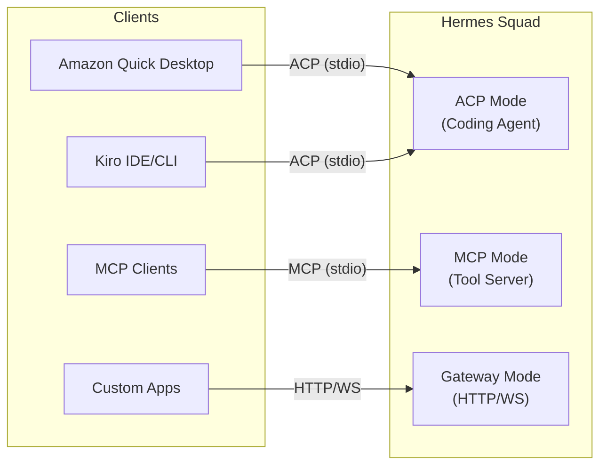

# Integration Guide

> Step-by-step instructions for connecting Hermes Squad to Amazon Quick Desktop, Kiro IDE, MCP clients, and remote machines.

---

## Table of Contents

- [Overview](#overview)
- [Amazon Quick Desktop via ACP](#amazon-quick-desktop-via-acp)
- [Kiro IDE via ACP](#kiro-ide-via-acp)
- [MCP Server Mode](#mcp-server-mode)
- [Remote SSH Setup](#remote-ssh-setup)
- [Troubleshooting](#troubleshooting)

---

## Overview

Hermes Squad supports three integration modes:

| Mode | Protocol | Transport | Use Case |
|------|----------|-----------|----------|
| **ACP Coding Agent** | JSON-RPC 2.0 | stdio | Amazon Quick, Kiro IDE — full agent capabilities |
| **MCP Server** | JSON-RPC 2.0 | stdio | Any MCP client — tool/resource exposure |
| **Gateway** | REST + WebSocket | HTTP | Custom integrations, web UIs, automation |



> ⚠️ **Critical distinction**: ACP and MCP are different protocols with different registration points in Quick/Kiro. Hermes Squad registers as a **Coding Agent** (ACP), NOT an MCP Server, when used for agent capabilities.

---

## Amazon Quick Desktop via ACP

### What is ACP?

**Agent Client Protocol (ACP)** is the protocol Amazon Quick uses to communicate with coding agents. It's based on JSON-RPC 2.0 over stdio, allowing Quick to:

- Send coding tasks to external agents
- Receive streaming progress updates
- Get structured results back

### Prerequisites

- Amazon Quick Desktop installed and running
- Hermes Squad installed and in your `PATH`
- Quick version 2.x or later (ACP support)

### Step 1: Verify Installation

```bash
# Confirm hermes-squad is accessible
which hermes-squad
# or on Windows:
where hermes-squad

# Test ACP mode starts correctly
echo '{"jsonrpc":"2.0","method":"initialize","id":1,"params":{}}' | hermes-squad serve --acp
```

Expected response:
```json
{
  "jsonrpc": "2.0",
  "id": 1,
  "result": {
    "name": "hermes-squad",
    "version": "0.1.0",
    "capabilities": {
      "tasks": true,
      "sessions": true,
      "skills": true,
      "streaming": true
    }
  }
}
```

### Step 2: Register in Amazon Quick

1. Open **Amazon Quick Desktop**
2. Navigate to **Settings** → **Capabilities** → **MCP**
3. Look for the **"Coding Agents"** section (NOT "MCP Servers")
4. Click **"Add Agent"**
5. Fill in the configuration:

```json
{
  "name": "Hermes Squad",
  "command": "hermes-squad",
  "args": ["serve", "--acp"],
  "transport": "stdio",
  "env": {
    "HERMES_SQUAD_PROFILE": "quick",
    "HERMES_SQUAD_LOG_LEVEL": "info"
  }
}
```

> 📍 **Why "Coding Agents" and NOT "MCP Servers"?**
>
> - **Coding Agents (ACP)**: Full agent capabilities — can execute multi-step tasks, manage sessions, learn skills, maintain state across interactions.
> - **MCP Servers**: Tool providers — expose discrete tools/resources but don't maintain agent state.
>
> Hermes Squad is an **agent**, not just a tool provider. Register it as a Coding Agent to get full functionality.

### Step 3: Configure the Quick Profile

Create a profile optimized for Quick integration:

```yaml
# ~/.hermes-squad/profiles/quick.yaml
name: quick
description: "Profile for Amazon Quick Desktop integration"

acp:
  enabled: true
  capabilities:
    - tasks
    - sessions
    - skills
    - streaming
  max_concurrent_sessions: 5
  auto_accept:
    enabled: true
    patterns:
      - "*.py"
      - "*.ts"
      - "*.go"
      - "*.md"
    excluded_patterns:
      - "*.env"
      - "secrets.*"

skills:
  auto_improve: true
  share_across_sessions: true

session:
  default_worktree: true
  cleanup_on_complete: true
```

### Step 4: Verify Connection

In Amazon Quick, you should now see "Hermes Squad" listed under available coding agents. Test it:

1. Open a new Quick chat
2. Ask Quick to delegate a coding task
3. Quick will route it to Hermes Squad via ACP
4. Check logs: `tail -f ~/.hermes-squad/logs/acp.log`

### ACP Message Examples

**Task request from Quick:**
```json
{
  "jsonrpc": "2.0",
  "method": "tasks/execute",
  "id": 42,
  "params": {
    "task": "Refactor the user authentication module to use JWT tokens",
    "workspace": "/home/user/project",
    "context": {
      "files": ["src/auth.py", "src/models/user.py"],
      "language": "python"
    }
  }
}
```

**Streaming progress update:**
```json
{
  "jsonrpc": "2.0",
  "method": "tasks/progress",
  "params": {
    "taskId": "sess_abc123",
    "status": "running",
    "message": "Creating git worktree for isolated changes...",
    "progress": 0.15
  }
}
```

**Task completion:**
```json
{
  "jsonrpc": "2.0",
  "id": 42,
  "result": {
    "status": "completed",
    "sessionId": "sess_abc123",
    "summary": "Refactored auth module to JWT. Changed 3 files, added 2 new.",
    "diff": "...",
    "skillsLearned": ["jwt-auth-refactor"]
  }
}
```

---

## Kiro IDE via ACP

### Overview

Kiro IDE has **native ACP support**, making integration straightforward. Kiro can communicate with Hermes Squad the same way Amazon Quick does.

### Step 1: Configure Kiro

Add to your Kiro settings (`.kiro/settings.json` or via Kiro UI):

```json
{
  "agents": {
    "hermes-squad": {
      "command": "hermes-squad",
      "args": ["serve", "--acp"],
      "transport": "stdio",
      "env": {
        "HERMES_SQUAD_PROFILE": "kiro"
      },
      "capabilities": ["tasks", "sessions", "skills"]
    }
  }
}
```

### Step 2: Kiro CLI Integration

For Kiro CLI usage:

```bash
# Register Hermes Squad with Kiro CLI
kiro agent add hermes-squad --command "hermes-squad serve --acp"

# Verify registration
kiro agent list

# Send a task via CLI
kiro agent run hermes-squad "Fix the failing unit tests in src/auth/"
```

### Step 3: Kiro-Specific Profile

```yaml
# ~/.hermes-squad/profiles/kiro.yaml
name: kiro
description: "Profile for Kiro IDE integration"

acp:
  enabled: true
  capabilities:
    - tasks
    - sessions
    - skills
    - streaming
  ide_integration:
    auto_open_diff: true
    inline_suggestions: true

session:
  default_worktree: true
  # Kiro manages its own git state, so be careful
  worktree_prefix: "hs-"

skills:
  auto_improve: true
  context_from_ide: true  # Use Kiro's file context
```

### Step 4: Using from Kiro

Once registered, you can:

1. **Delegate tasks** — Select code, right-click → "Send to Hermes Squad"
2. **View sessions** — Kiro's agent panel shows active Hermes Squad sessions
3. **Review diffs** — Changes appear in Kiro's diff viewer
4. **Skill suggestions** — Hermes Squad suggests relevant skills based on context

---

## MCP Server Mode

### When to Use MCP Mode

Use MCP mode when you want to **expose Hermes Squad's tools** to MCP-compatible clients without full agent capabilities:

- Quick Desktop needs specific tools (not full agent delegation)
- Other MCP clients (VS Code extensions, custom tools)
- Tool composition — chain Hermes Squad tools with other MCP servers

### Step 1: Start as MCP Server

```bash
# Start in MCP server mode
hermes-squad serve --mcp

# With specific tools exposed
hermes-squad serve --mcp --tools "session,skills,memory"

# With custom transport
hermes-squad serve --mcp --transport sse --port 8080
```

### Step 2: Register as MCP Server in Quick

If you want to expose tools (not agent capabilities) to Quick:

1. Open **Settings** → **Capabilities** → **MCP**
2. Under **"MCP Servers"** section, click "Add Server"
3. Configure:

```json
{
  "name": "hermes-squad-tools",
  "command": "hermes-squad",
  "args": ["serve", "--mcp"],
  "transport": "stdio"
}
```

### Step 3: Available MCP Tools

When running as an MCP server, Hermes Squad exposes these tools:

| Tool | Description |
|------|-------------|
| `session_create` | Create a new agent session with worktree |
| `session_list` | List all active sessions |
| `session_status` | Get status of a specific session |
| `session_terminate` | End a session and cleanup |
| `skill_execute` | Execute a named skill |
| `skill_list` | List available skills |
| `skill_create` | Create a new skill from description |
| `memory_query` | Search the knowledge graph |
| `memory_store` | Store a new memory/fact |
| `diff_preview` | Get the current diff for a session |
| `diff_apply` | Apply/merge changes from a session |

### MCP Tool Schema Example

```json
{
  "tools": [
    {
      "name": "session_create",
      "description": "Create a new isolated agent session with git worktree",
      "inputSchema": {
        "type": "object",
        "properties": {
          "name": {
            "type": "string",
            "description": "Human-readable session name"
          },
          "workspace": {
            "type": "string",
            "description": "Path to the git repository"
          },
          "task": {
            "type": "string",
            "description": "Task description for the agent"
          },
          "auto_accept": {
            "type": "boolean",
            "default": false,
            "description": "Enable auto-accept mode"
          }
        },
        "required": ["name", "workspace", "task"]
      }
    },
    {
      "name": "skill_execute",
      "description": "Execute a learned skill by name",
      "inputSchema": {
        "type": "object",
        "properties": {
          "skill_name": {
            "type": "string",
            "description": "Name of the skill to execute"
          },
          "context": {
            "type": "object",
            "description": "Execution context (files, parameters)"
          }
        },
        "required": ["skill_name"]
      }
    }
  ]
}
```

### MCP Resources

Hermes Squad also exposes resources via MCP:

```json
{
  "resources": [
    {
      "uri": "hermes-squad://skills",
      "name": "Available Skills",
      "mimeType": "application/json"
    },
    {
      "uri": "hermes-squad://sessions",
      "name": "Active Sessions",
      "mimeType": "application/json"
    },
    {
      "uri": "hermes-squad://memory/recent",
      "name": "Recent Memories",
      "mimeType": "application/json"
    }
  ]
}
```

---

## Remote SSH Setup

### Overview

Hermes Squad can manage agents on remote machines via SSH. This is useful for:

- Running agents on powerful remote servers
- Managing agents across multiple machines
- Headless/CI environments

### Key Requirement: `-T` Flag

> ⚠️ **Critical**: Always use `ssh -T` (no PTY allocation) when connecting to Hermes Squad remotely. The ACP/MCP protocols use stdio and a PTY interferes with JSON-RPC framing.

### Step 1: Install on Remote Machine

```bash
# On the remote machine
ssh user@remote-host
git clone https://github.com/hermes-squad/hermes-squad.git
cd hermes-squad
make install

# Verify
hermes-squad --version
```

### Step 2: Configure SSH

Add to your local `~/.ssh/config`:

```ssh-config
Host hermes-remote
    HostName remote-host.example.com
    User your-username
    # CRITICAL: Disable PTY allocation for ACP/MCP
    RequestTTY no
    # Keep connection alive
    ServerAliveInterval 60
    ServerAliveCountMax 3
    # Forward agent for git operations
    ForwardAgent yes
```

### Step 3: Direct SSH Invocation

```bash
# Run Hermes Squad in ACP mode over SSH (note -T flag!)
ssh -T user@remote-host hermes-squad serve --acp

# Or with environment variables
ssh -T -o SendEnv=HERMES_SQUAD_PROFILE user@remote-host hermes-squad serve --acp
```

### Step 4: Register Remote Agent in Quick

```json
{
  "name": "Hermes Squad (Remote)",
  "command": "ssh",
  "args": ["-T", "hermes-remote", "hermes-squad", "serve", "--acp"],
  "transport": "stdio",
  "env": {}
}
```

### Step 5: Register Remote Agent in Kiro

```json
{
  "agents": {
    "hermes-squad-remote": {
      "command": "ssh",
      "args": ["-T", "hermes-remote", "hermes-squad", "serve", "--acp"],
      "transport": "stdio"
    }
  }
}
```

### SSH Tunneling for Gateway Mode

If you need the HTTP/WebSocket gateway remotely:

```bash
# Forward gateway port
ssh -L 8765:localhost:8765 user@remote-host

# On remote, start gateway
hermes-squad serve --gateway --port 8765

# Access locally at http://localhost:8765
```

### SSH Security Considerations

| Concern | Mitigation |
|---------|-----------|
| Credential exposure | Use SSH keys, not passwords |
| Agent forwarding risk | Use `ForwardAgent` only when needed |
| Unrestricted access | Configure `AllowedCommands` in sshd |
| Network interruption | Sessions persist in tmux — reconnect anytime |

---

## Troubleshooting

### ACP Connection Issues

**Problem**: Quick/Kiro can't connect to Hermes Squad

```bash
# Check if hermes-squad is in PATH
which hermes-squad

# Test stdio communication manually
echo '{"jsonrpc":"2.0","method":"initialize","id":1,"params":{}}' | hermes-squad serve --acp

# Check logs
tail -f ~/.hermes-squad/logs/acp.log
```

**Problem**: Registered as MCP Server instead of Coding Agent

- Remove from "MCP Servers" section
- Re-add under "Coding Agents" section
- The protocols are similar but capabilities differ!

### MCP Issues

**Problem**: Tools not appearing in client

```bash
# List exposed tools
hermes-squad serve --mcp --list-tools

# Check MCP protocol compliance
echo '{"jsonrpc":"2.0","method":"tools/list","id":1}' | hermes-squad serve --mcp
```

### SSH Issues

**Problem**: Garbled output over SSH

```bash
# WRONG - PTY will corrupt JSON-RPC framing
ssh user@host hermes-squad serve --acp

# CORRECT - No PTY
ssh -T user@host hermes-squad serve --acp
```

**Problem**: Connection drops

```bash
# Add keepalive settings
ssh -T -o ServerAliveInterval=60 -o ServerAliveCountMax=3 user@host hermes-squad serve --acp
```

### General Debugging

```bash
# Enable debug logging
HERMES_SQUAD_LOG_LEVEL=debug hermes-squad serve --acp

# Trace all JSON-RPC messages
HERMES_SQUAD_TRACE_RPC=true hermes-squad serve --acp 2>rpc-trace.log

# Check system requirements
hermes-squad doctor
```

---

## See Also

- [Architecture](ARCHITECTURE.md) — System architecture and component details
- [Configuration](CONFIGURATION.md) — Full configuration reference
- [Session Management](SESSION-MANAGEMENT.md) — How sessions work
- [Skills System](SKILLS-SYSTEM.md) — Self-improving skills
