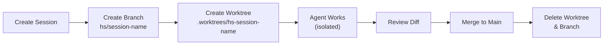
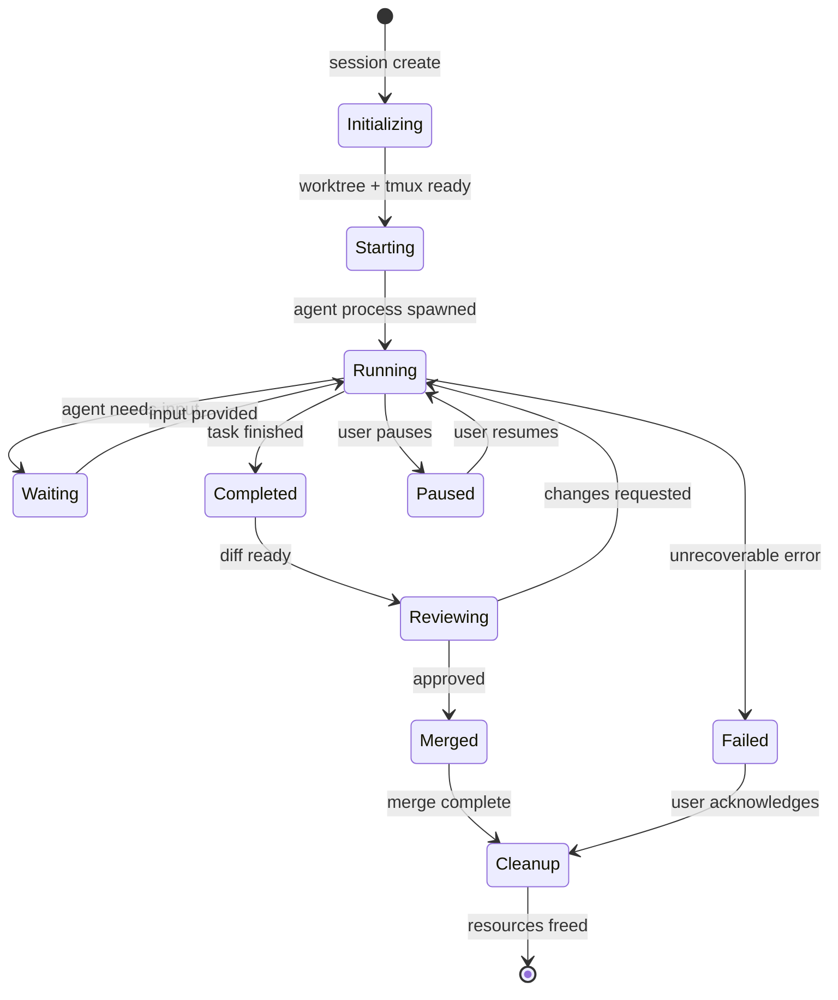
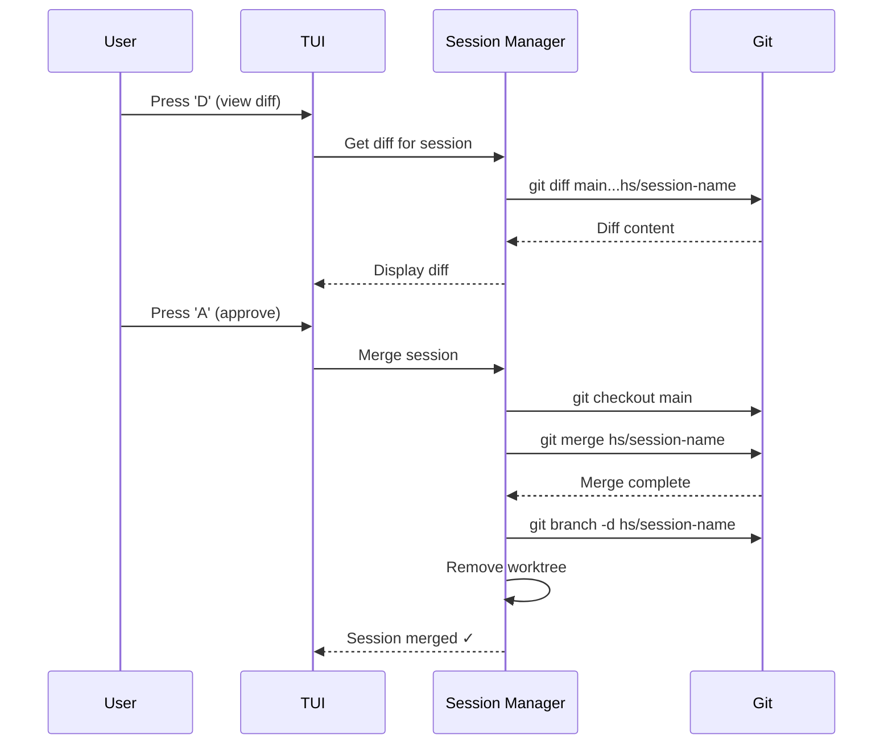

# Session Management

> How Hermes Squad's multi-agent session management works — borrowed from Claude Squad and enhanced with skills integration.

---

## Table of Contents

- [Overview](#overview)
- [Core Concepts](#core-concepts)
- [Git Worktrees](#git-worktrees)
- [Tmux Sessions](#tmux-sessions)
- [Agent Lifecycle](#agent-lifecycle)
- [Auto-Accept Mode](#auto-accept-mode)
- [Diff Preview & Merge](#diff-preview--merge)
- [Multi-Agent Coordination](#multi-agent-coordination)
- [TUI Controls](#tui-controls)

---

## Overview

Session Management is the orchestration layer inherited from Claude Squad. It allows you to run **multiple AI agents simultaneously**, each in its own isolated environment, with full visibility and control from a single terminal.

```
┌─────────────────────────────────────────────────────────────────────┐
│                     Hermes Squad TUI                                  │
├──────────┬──────────────────────────────────────────────────────────┤
│ Sessions │                                                           │
│          │                                                           │
│ ▶ auth   │  Agent: Working on JWT auth refactor...                  │
│   refact │  Worktree: /project/.worktrees/hs-auth-refactor          │
│   or     │  Status: Running (auto-accept: ON)                       │
│          │  Skills: jwt-auth-refactor (v3)                          │
│   api    │  Duration: 3m 42s                                        │
│   tests  │                                                           │
│          │  ┌─────────────────────────────────────────────────────┐ │
│   docker │  │ $ Modifying src/auth/middleware.py...                │ │
│   setup  │  │ $ Running tests: pytest tests/auth/ -v              │ │
│          │  │ ✓ 12 passed, 0 failed                               │ │
│   docs   │  │ $ Updating imports in 3 files...                    │ │
│   update │  └─────────────────────────────────────────────────────┘ │
│          │                                                           │
├──────────┴──────────────────────────────────────────────────────────┤
│ [N]ew [D]iff [A]ccept [K]ill [S]kills [?]Help     5 sessions active│
└─────────────────────────────────────────────────────────────────────┘
```

---

## Core Concepts

| Concept | Description |
|---------|-------------|
| **Session** | A managed environment containing an agent, worktree, and tmux pane |
| **Agent** | The AI coding process running inside a session |
| **Worktree** | Isolated git working directory for the agent's changes |
| **Tmux Pane** | Terminal multiplexer pane showing agent activity |
| **Auto-Accept** | Mode where agents can make changes without manual approval |
| **Diff** | Preview of all changes made by an agent before merging |

---

## Git Worktrees

### What Are Git Worktrees?

Git worktrees allow multiple working directories to share a single `.git` repository. Each agent gets its own worktree, so:

- ✅ Agents can't conflict with each other
- ✅ Agents can't corrupt your main working directory
- ✅ Each agent has a clean, independent branch
- ✅ Changes are isolated until explicitly merged

### Worktree Lifecycle



### Worktree Structure

```
/your/project/
├── .git/                          # Shared git database
├── .worktrees/                    # Hermes Squad worktrees
│   ├── hs-auth-refactor/         # Session 1's isolated copy
│   │   ├── src/
│   │   ├── tests/
│   │   └── ...
│   ├── hs-api-tests/             # Session 2's isolated copy
│   │   ├── src/
│   │   ├── tests/
│   │   └── ...
│   └── hs-docker-setup/          # Session 3's isolated copy
│       ├── Dockerfile
│       ├── docker-compose.yaml
│       └── ...
├── src/                           # Your main working directory
├── tests/                         # (unchanged by agents)
└── ...
```

### Worktree Configuration

```yaml
# ~/.hermes-squad/config.yaml
session:
  worktree:
    # Where to create worktrees (relative to repo root)
    directory: ".worktrees"
    # Branch prefix
    prefix: "hs/"
    # Auto-cleanup on session end
    cleanup_on_terminate: true
    # Base branch for new worktrees
    base_branch: "main"  # or "HEAD" for current branch
    # Maximum concurrent worktrees
    max_worktrees: 10
```

### Worktree Commands

```bash
# List active worktrees
hermes-squad session list --show-worktrees

# Inspect a session's worktree
hermes-squad session worktree auth-refactor

# Manually cleanup orphaned worktrees
hermes-squad session cleanup --orphaned

# Force cleanup all worktrees
hermes-squad session cleanup --all
```

---

## Tmux Sessions

### Why Tmux?

Tmux provides:
- **Persistence** — Sessions survive terminal disconnects
- **Multiplexing** — Multiple agents visible simultaneously
- **Scriptability** — Programmatic control of terminal sessions
- **Detach/reattach** — Come back to running agents anytime

### Tmux Architecture

```
┌─────────────────────────────────────────────────────┐
│ tmux server                                          │
│                                                      │
│  ┌────────────────────────────────────────────────┐ │
│  │ Session: hermes-squad                          │ │
│  │                                                 │ │
│  │  ┌──────────┐ ┌──────────┐ ┌──────────┐      │ │
│  │  │ Window 0 │ │ Window 1 │ │ Window 2 │ ...  │ │
│  │  │ (agent1) │ │ (agent2) │ │ (agent3) │      │ │
│  │  │          │ │          │ │          │      │ │
│  │  │ Pane 0:  │ │ Pane 0:  │ │ Pane 0:  │      │ │
│  │  │ Agent    │ │ Agent    │ │ Agent    │      │ │
│  │  │ output   │ │ output   │ │ output   │      │ │
│  │  └──────────┘ └──────────┘ └──────────┘      │ │
│  └────────────────────────────────────────────────┘ │
└─────────────────────────────────────────────────────┘
```

### Tmux Session Naming

Sessions follow the convention: `hs-{session-name}-{short-id}`

```bash
# List Hermes Squad tmux sessions
tmux list-sessions | grep "^hs-"

# Attach to a specific agent's tmux session (for debugging)
tmux attach -t hs-auth-refactor-a1b2

# The TUI manages this automatically — you rarely need manual tmux
```

### Tmux Configuration

```yaml
session:
  tmux:
    # Socket name (allows multiple Hermes Squad instances)
    socket: "hermes-squad"
    # History limit per pane
    history_limit: 10000
    # Capture output for skill extraction
    capture_output: true
    # Shell for agent processes
    shell: "/bin/bash"
```

---

## Agent Lifecycle

### States



### Creating a Session

```bash
# Interactive creation via TUI
hermes-squad
# Then press 'N' for new session

# CLI creation
hermes-squad session new \
  --name "auth-refactor" \
  --task "Refactor authentication to use JWT" \
  --workspace /path/to/project \
  --auto-accept

# With specific agent model
hermes-squad session new \
  --name "api-tests" \
  --task "Write comprehensive API tests" \
  --agent-model "claude-sonnet" \
  --workspace /path/to/project
```

### Session Data Structure

```go
type Session struct {
    ID          string          `json:"id"`
    Name        string          `json:"name"`
    Status      SessionStatus   `json:"status"`
    Task        string          `json:"task"`
    Workspace   string          `json:"workspace"`
    Worktree    string          `json:"worktree"`
    Branch      string          `json:"branch"`
    TmuxSession string          `json:"tmux_session"`
    AgentPID    int             `json:"agent_pid"`
    AutoAccept  bool            `json:"auto_accept"`
    Skills      []string        `json:"skills"`
    CreatedAt   time.Time       `json:"created_at"`
    UpdatedAt   time.Time       `json:"updated_at"`
    Metrics     SessionMetrics  `json:"metrics"`
}

type SessionMetrics struct {
    Duration      time.Duration `json:"duration"`
    FilesChanged  int           `json:"files_changed"`
    LinesAdded    int           `json:"lines_added"`
    LinesRemoved  int           `json:"lines_removed"`
    SkillsUsed    int           `json:"skills_used"`
    SkillsLearned int           `json:"skills_learned"`
}
```

---

## Auto-Accept Mode

### What is Auto-Accept?

Auto-accept mode allows agents to make changes without stopping for manual approval at each step. This enables **autonomous operation** while maintaining safety through configurable guardrails.

### Safety Guardrails

```yaml
session:
  auto_accept:
    # Global enable/disable
    enabled: true

    # File patterns allowed for auto-modification
    allowed_patterns:
      - "*.py"
      - "*.ts"
      - "*.tsx"
      - "*.go"
      - "*.md"
      - "*.yaml"
      - "*.json"
      - "tests/**"

    # Files that ALWAYS require manual approval
    protected_patterns:
      - "*.env"
      - "*.secret"
      - "**/secrets/**"
      - "Makefile"
      - "Dockerfile"
      - ".github/workflows/*"
      - "package.json"  # dependency changes need review

    # Command execution rules
    commands:
      allowed:
        - "go test ./..."
        - "pytest"
        - "npm test"
        - "cargo test"
        - "git diff"
        - "git status"
      blocked:
        - "rm -rf"
        - "sudo *"
        - "curl * | bash"
        - "pip install"  # use requirements.txt instead

    # Limits
    max_files_per_action: 10
    max_lines_per_file: 500
    require_tests: true  # Block if tests not included
```

### Auto-Accept Behavior

| Scenario | Behavior |
|----------|----------|
| Agent modifies `src/auth.py` | ✅ Auto-accepted (matches `*.py`) |
| Agent modifies `.env` | ❌ Pauses for manual review |
| Agent runs `pytest` | ✅ Auto-accepted (allowed command) |
| Agent runs `pip install requests` | ❌ Pauses for manual review |
| Agent modifies 15 files at once | ❌ Exceeds `max_files_per_action` |
| Agent adds code without tests | ❌ Blocked by `require_tests` |

### Toggling Auto-Accept

```bash
# Enable for a running session
hermes-squad session auto-accept auth-refactor --on

# Disable
hermes-squad session auto-accept auth-refactor --off

# In TUI: press 'A' to toggle for selected session
```

---

## Diff Preview & Merge

### Viewing Diffs

The diff system provides a complete view of all changes made by an agent:

```bash
# View diff for a session
hermes-squad session diff auth-refactor

# View in TUI (press 'D' with session selected)

# Export diff
hermes-squad session diff auth-refactor --output diff.patch
```

### Diff Display

```
┌─ Diff Preview: auth-refactor ──────────────────────────────────────┐
│                                                                      │
│ Modified: src/auth/middleware.py                                     │
│ ─────────────────────────────────────────                           │
│  @@ -15,8 +15,12 @@                                                │
│  -from flask import session                                         │
│  +from flask import request                                         │
│  +from auth.jwt_utils import validate_token, TokenExpired           │
│                                                                      │
│  -def require_auth(f):                                              │
│  -    if 'user_id' not in session:                                  │
│  -        abort(401)                                                │
│  +def require_auth(f):                                              │
│  +    token = request.headers.get('Authorization', '').split()      │
│  +    if len(token) != 2 or token[0] != 'Bearer':                  │
│  +        abort(401, 'Missing bearer token')                        │
│  +    try:                                                          │
│  +        payload = validate_token(token[1])                        │
│  +    except TokenExpired:                                          │
│  +        abort(401, 'Token expired')                               │
│                                                                      │
│ New: src/auth/jwt_utils.py                                          │
│ ─────────────────────────────────────────                           │
│  +"""JWT utility functions for token management."""                  │
│  +import jwt                                                        │
│  +from datetime import datetime, timedelta                          │
│  ...                                                                │
│                                                                      │
│ [A]pprove  [R]eject  [E]dit  [P]artial  [Q]uit                    │
└──────────────────────────────────────────────────────────────────────┘
```

### Merge Options

| Option | Description |
|--------|-------------|
| **Approve** | Merge all changes to main branch |
| **Reject** | Discard all changes, cleanup worktree |
| **Edit** | Open diff in editor for manual modifications |
| **Partial** | Select specific files/hunks to merge |

### Merge Process



### Conflict Resolution

If the main branch changed while an agent was working:

```bash
# Hermes Squad auto-detects conflicts
# Option 1: Rebase agent's work on latest main
hermes-squad session rebase auth-refactor

# Option 2: Merge main into agent's branch (preserves history)
hermes-squad session update auth-refactor

# Option 3: Let the agent resolve conflicts
hermes-squad session resolve auth-refactor
```

---

## Multi-Agent Coordination

### Running Multiple Agents

```bash
# Create multiple sessions
hermes-squad session new --name "frontend" --task "Build login UI"
hermes-squad session new --name "backend" --task "Create auth API"
hermes-squad session new --name "tests" --task "Write integration tests"

# All run simultaneously in their own worktrees
hermes-squad session list
```

### Coordination Strategies

```yaml
session:
  coordination:
    # How to handle shared file modifications
    conflict_strategy: "first-wins"  # first-wins | last-wins | manual

    # Enable inter-session communication
    message_passing: true

    # Dependency ordering
    dependencies:
      tests:
        depends_on: [frontend, backend]
        wait_strategy: "completion"  # completion | milestone
```

### Session Communication

Agents can share information:

```python
# Agent in "backend" session signals API schema is ready
await session.broadcast(
    event="schema_ready",
    data={"file": "api/schema.yaml"},
    target_sessions=["frontend", "tests"]
)

# Agent in "frontend" session receives and uses the schema
@session.on("schema_ready")
async def handle_schema(event):
    schema = await read_file(event.data["file"])
    # Use schema to generate API client...
```

---

## TUI Controls

### Key Bindings

| Key | Action |
|-----|--------|
| `N` | New session |
| `Enter` | Attach to selected session (view live output) |
| `D` | View diff for selected session |
| `A` | Toggle auto-accept for selected session |
| `K` | Kill/terminate selected session |
| `P` | Pause/resume selected session |
| `S` | Open skills browser |
| `M` | View memory/knowledge graph |
| `C` | Configuration editor |
| `↑/↓` or `j/k` | Navigate session list |
| `Tab` | Switch between panels |
| `?` | Help |
| `Q` | Quit (sessions persist in tmux) |

### TUI Layout

```
┌───────────────────────────────────────────────────────────────────┐
│ Hermes Squad v0.1.0                              5 sessions │ 3 ▶ │
├──────────┬────────────────────────────────────────────────────────┤
│ Sessions │ Session: auth-refactor                                  │
│          │ ────────────────────────────────────────────────────── │
│ ▶ auth.. │ Task: Refactor authentication to use JWT               │
│   api-t. │ Status: Running  │  Auto-Accept: ON                   │
│   docker │ Worktree: .worktrees/hs-auth-refactor                  │
│   docs.. │ Branch: hs/auth-refactor                               │
│   tests. │ Duration: 5m 12s │  Files changed: 4                  │
│          │ Skills: jwt-auth-refactor (v3)                         │
│          │                                                         │
│          │ ┌─ Live Output ──────────────────────────────────────┐ │
│          │ │ Analyzing current auth implementation...            │ │
│          │ │ Found session-based auth in 3 files               │ │
│          │ │ Installing pyjwt and cryptography...              │ │
│          │ │ Creating jwt_utils.py...                          │ │
│          │ │ ✓ Token generation implemented                    │ │
│          │ │ ✓ Token validation implemented                    │ │
│          │ │ Updating middleware...                             │ │
│          │ └───────────────────────────────────────────────────┘ │
├──────────┴────────────────────────────────────────────────────────┤
│ [N]ew [D]iff [A]uto-Accept [K]ill [S]kills [?]Help              │
└───────────────────────────────────────────────────────────────────┘
```

---

## Session Persistence

### What Persists Across Restarts

| Component | Persists? | Location |
|-----------|-----------|----------|
| Tmux sessions | ✅ | tmux server (background) |
| Git worktrees | ✅ | `.worktrees/` directory |
| Agent processes | ❌ | Must be re-spawned |
| Session metadata | ✅ | `~/.hermes-squad/sessions/` |
| Diffs | ✅ | In git (committed to branch) |
| Skills learned | ✅ | `~/.hermes-squad/skills/` |

### Resuming After Disconnect

```bash
# The TUI reconnects to existing tmux sessions automatically
hermes-squad

# Or list what's still running
hermes-squad session list --include-detached

# Reattach to a specific session
hermes-squad session attach auth-refactor
```

---

## See Also

- [Architecture](ARCHITECTURE.md) — How session management fits in the system
- [Skills System](SKILLS-SYSTEM.md) — How sessions interact with skills
- [Configuration](CONFIGURATION.md) — Session configuration options
- [Integration Guide](INTEGRATION-GUIDE.md) — Remote session management via SSH
