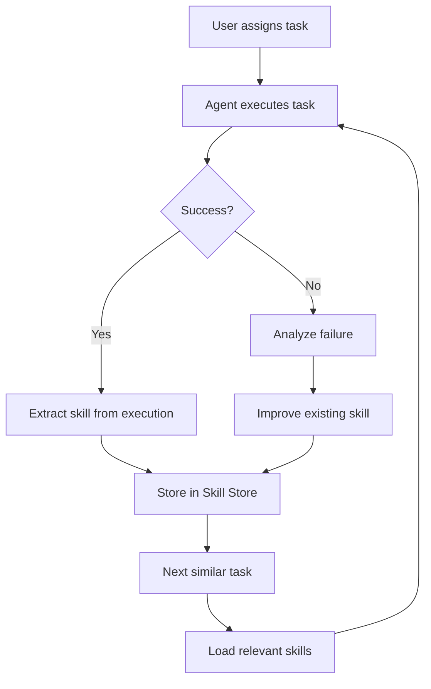
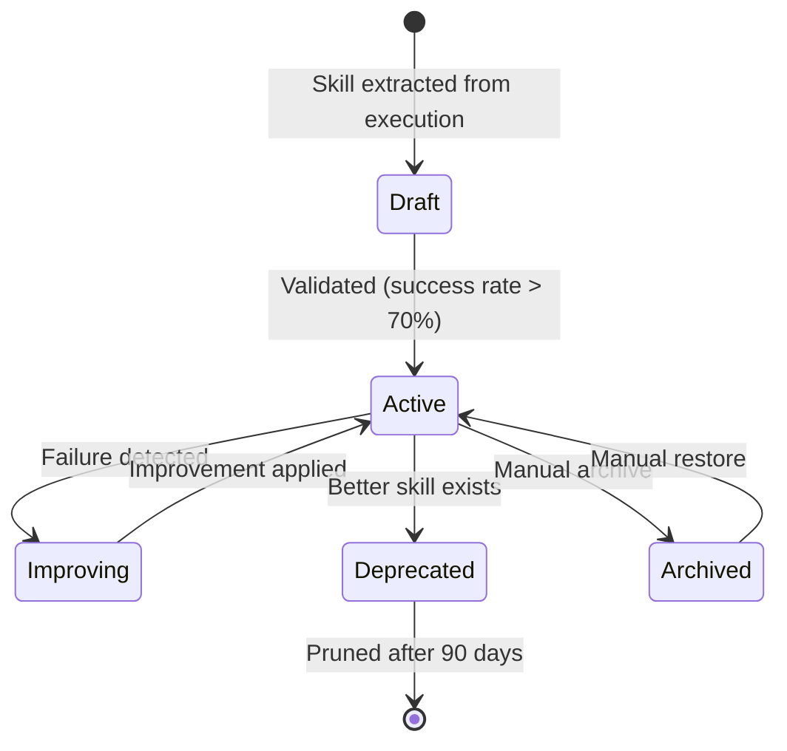
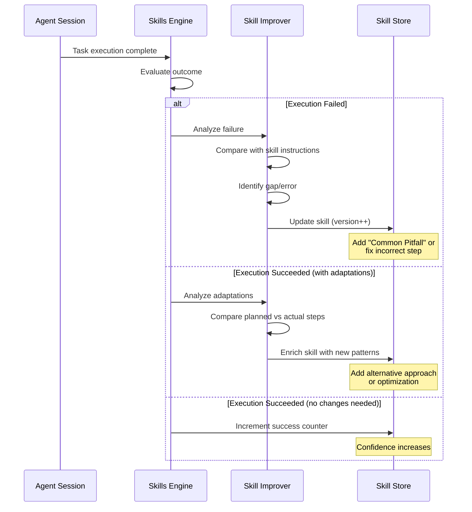
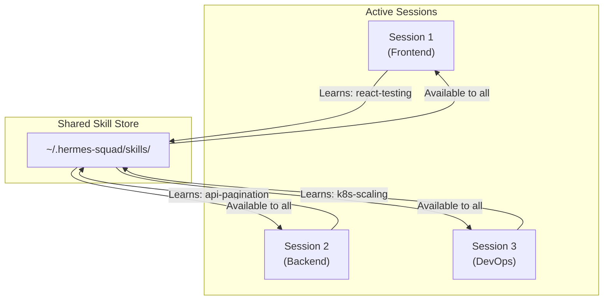

# Skills System

> How Hermes Squad's self-improving skills system works — borrowed from Hermes Agent and extended for multi-agent session management.

---

## Table of Contents

- [Overview](#overview)
- [What is a Skill?](#what-is-a-skill)
- [Skill Lifecycle](#skill-lifecycle)
- [Skill Creation](#skill-creation)
- [Improvement Loops](#improvement-loops)
- [Skill Store](#skill-store)
- [Cross-Session Sharing](#cross-session-sharing)
- [Cron & Automated Execution](#cron--automated-execution)
- [Skill API](#skill-api)

---

## Overview

The Skills System is what makes Hermes Squad **self-improving**. Unlike traditional AI coding assistants that start fresh each session, Hermes Squad:

1. **Learns** from successful task completions
2. **Persists** learned knowledge as reusable skills
3. **Improves** skills based on execution feedback
4. **Shares** skills across all agent sessions

This creates a positive feedback loop where the system gets better the more you use it.



---

## What is a Skill?

A skill is a **reusable, versioned unit of knowledge** that encodes how to accomplish a specific type of task. Skills are more than just prompts — they include:

### Skill Structure

```yaml
# ~/.hermes-squad/skills/jwt-auth-refactor.yaml
name: jwt-auth-refactor
version: 3
description: "Refactor authentication modules to use JWT tokens"
created: "2024-01-15T10:30:00Z"
updated: "2024-02-20T14:15:00Z"

# When this skill should be suggested/triggered
triggers:
  - pattern: "refactor.*auth.*jwt"
    confidence: 0.9
  - pattern: "add jwt.*authentication"
    confidence: 0.8
  - file_patterns:
      - "**/auth*.py"
      - "**/middleware/auth*"

# The actual instructions the agent follows
instructions: |
  ## JWT Auth Refactoring Procedure

  1. Identify the current auth mechanism (session-based, basic auth, etc.)
  2. Install required packages: `pyjwt`, `cryptography`
  3. Create JWT utility module:
     - Token generation with configurable expiry
     - Token validation with proper error handling
     - Refresh token rotation
  4. Update auth middleware to validate JWT headers
  5. Migrate existing session data to JWT claims
  6. Update tests to use JWT fixtures
  7. Add token refresh endpoint

  ### Common Pitfalls
  - Always use RS256 for production (not HS256)
  - Set reasonable token expiry (15min access, 7d refresh)
  - Don't store sensitive data in JWT payload
  - Handle token revocation via blacklist

# Execution context requirements
requirements:
  languages: [python]
  frameworks: [flask, fastapi, django]
  tools: [pip, pytest]

# Performance metrics
metrics:
  executions: 12
  successes: 11
  failures: 1
  avg_duration_seconds: 145
  last_execution: "2024-02-20T14:15:00Z"
  improvement_score: 0.92

# Improvement history
history:
  - version: 1
    date: "2024-01-15T10:30:00Z"
    change: "Initial skill creation from successful JWT migration"
  - version: 2
    date: "2024-01-28T09:00:00Z"
    change: "Added RS256 recommendation after HS256 caused issues"
  - version: 3
    date: "2024-02-20T14:15:00Z"
    change: "Added refresh token rotation pattern"
```

### Skill Components

| Component | Purpose |
|-----------|---------|
| `name` | Unique identifier |
| `version` | Auto-incrementing version number |
| `description` | Human-readable summary |
| `triggers` | When to activate (pattern matching, file patterns) |
| `instructions` | Step-by-step guidance for the agent |
| `requirements` | Context needed (languages, tools, frameworks) |
| `metrics` | Execution statistics and success rate |
| `history` | Version changelog |

---

## Skill Lifecycle



### States

| State | Description |
|-------|-------------|
| **Draft** | Newly created, not yet proven |
| **Active** | Validated and available for use |
| **Improving** | Currently being refined based on feedback |
| **Deprecated** | Superseded by a better skill |
| **Archived** | Manually removed from active rotation |

---

## Skill Creation

Skills can be created in three ways:

### 1. Automatic Extraction (Post-Task)

After a successful task completion, the Skills Engine analyzes the execution:

```python
# Internal flow (simplified)
async def post_task_analysis(execution: ExecutionRecord):
    # Check if this execution pattern is novel
    if not await skill_store.has_similar_skill(execution):
        # Extract a new skill
        skill = await skill_extractor.extract(
            task=execution.task,
            steps=execution.steps,
            result=execution.result,
            context=execution.context,
        )
        await skill_store.save(skill, state=SkillState.DRAFT)
        logger.info(f"New skill extracted: {skill.name}")
```

### 2. Manual Creation (User-Defined)

Create skills directly via the TUI or API:

```bash
# Via CLI
hermes-squad skill create \
  --name "docker-compose-setup" \
  --description "Set up Docker Compose for microservices" \
  --instructions-file ./instructions.md

# Via TUI
# Press 'S' to open Skills Browser → 'N' for New Skill
```

### 3. From Template (Skill Store)

Import pre-built skills from the community skill store:

```bash
# Browse available skills
hermes-squad skill store search "kubernetes deployment"

# Install a skill
hermes-squad skill store install k8s-deployment-blue-green

# List installed skills
hermes-squad skill list
```

---

## Improvement Loops

The improvement system is the core innovation from Hermes Agent. It continuously refines skills based on real execution outcomes.

### How Improvement Works



### Improvement Triggers

| Trigger | Action |
|---------|--------|
| Task failure with active skill | Analyze what went wrong, patch skill |
| Agent deviated from skill steps | Incorporate the deviation as alternative |
| User manually corrected output | Learn from correction |
| Repeated similar failures | Escalate — skill may need rewrite |
| Success rate drops below 70% | Flag for review |

### Improvement Example

**Before improvement (v1):**
```yaml
instructions: |
  1. Install JWT package: `pip install pyjwt`
  2. Create token generation function
  3. Add auth middleware
```

**After failure (user needed RS256, not default HS256):**
```yaml
instructions: |
  1. Install JWT packages: `pip install pyjwt cryptography`
  2. Create token generation function
     - Use RS256 algorithm (NOT HS256 for production)
     - Generate RSA key pair if not exists
  3. Add auth middleware

  ### Common Pitfalls
  - HS256 uses shared secret — insecure for distributed systems
  - Always use RS256 or ES256 for production deployments
```

### Improvement Configuration

```yaml
# In ~/.hermes-squad/config.yaml
skills:
  improvement:
    enabled: true
    # Minimum executions before improvement kicks in
    min_executions: 3
    # Success rate threshold to trigger review
    review_threshold: 0.7
    # Maximum skill version before manual review required
    max_auto_versions: 10
    # How aggressively to modify skills
    aggressiveness: moderate  # conservative | moderate | aggressive
```

---

## Skill Store

The Skill Store is the persistence and distribution layer for skills.

### Local Storage

Skills are stored as YAML files in a structured directory:

```
~/.hermes-squad/skills/
├── active/
│   ├── jwt-auth-refactor.yaml
│   ├── docker-compose-setup.yaml
│   └── react-component-test.yaml
├── draft/
│   └── graphql-resolver-pattern.yaml
├── deprecated/
│   └── old-session-auth.yaml
├── archived/
│   └── legacy-webpack-config.yaml
└── index.json          # Searchable index with embeddings
```

### Skill Index

The index enables fast retrieval:

```json
{
  "skills": [
    {
      "name": "jwt-auth-refactor",
      "state": "active",
      "triggers": ["refactor.*auth.*jwt", "add jwt.*authentication"],
      "file_patterns": ["**/auth*.py"],
      "embedding": [0.123, -0.456, ...],
      "metrics": {
        "executions": 12,
        "success_rate": 0.92
      }
    }
  ],
  "last_updated": "2024-02-20T14:15:00Z"
}
```

### Skill Retrieval

When a task comes in, the engine finds relevant skills:

```python
async def find_relevant_skills(task: str, context: Context) -> list[Skill]:
    candidates = []

    # 1. Pattern matching on triggers
    pattern_matches = await skill_store.match_triggers(task)
    candidates.extend(pattern_matches)

    # 2. File pattern matching
    if context.files:
        file_matches = await skill_store.match_file_patterns(context.files)
        candidates.extend(file_matches)

    # 3. Semantic search via embeddings
    semantic_matches = await skill_store.semantic_search(
        query=task,
        top_k=5,
        min_similarity=0.75
    )
    candidates.extend(semantic_matches)

    # 4. Rank and deduplicate
    ranked = rank_skills(candidates, task, context)
    return ranked[:3]  # Return top 3 most relevant
```

### Community Skill Store

Share and discover skills:

```bash
# Publish a skill to the community store
hermes-squad skill publish jwt-auth-refactor

# Search community skills
hermes-squad skill store search "kubernetes"

# Install from community
hermes-squad skill store install k8s-helm-chart-best-practices

# Rate a skill
hermes-squad skill store rate k8s-helm-chart-best-practices --stars 5
```

---

## Cross-Session Sharing

One of the key advantages of merging with Claude Squad: **skills learned in one agent session are immediately available to all other sessions**.

### How It Works



### Sharing Mechanics

1. **File-based sharing** — All sessions read from the same skill store
2. **File watcher** — Sessions detect new skills in real-time via fsnotify
3. **Context filtering** — Each session only loads skills relevant to its task
4. **Conflict resolution** — If two sessions improve the same skill simultaneously, the one with better metrics wins

### Configuration

```yaml
skills:
  sharing:
    enabled: true
    # Propagation delay (debounce for rapid changes)
    propagation_delay_ms: 500
    # Share across profiles?
    cross_profile: false
    # Share with remote instances?
    remote_sync:
      enabled: false
      endpoint: "https://skills.example.com/api"
```

---

## Cron & Automated Execution

Skills can be scheduled for automated execution using the cron system inherited from Hermes Agent.

### Cron Configuration

```yaml
# ~/.hermes-squad/cron.yaml
jobs:
  - name: "daily-code-review"
    skill: "code-review-checklist"
    schedule: "0 9 * * 1-5"  # 9 AM weekdays
    context:
      workspace: "/home/user/project"
      scope: "git diff HEAD~1"

  - name: "weekly-dependency-check"
    skill: "dependency-audit"
    schedule: "0 10 * * 1"  # Monday 10 AM
    context:
      workspace: "/home/user/project"
      check_security: true

  - name: "auto-docs-update"
    skill: "readme-sync"
    schedule: "0 17 * * 5"  # Friday 5 PM
    context:
      workspace: "/home/user/project"
      target: "docs/"
```

### Cron Commands

```bash
# List scheduled jobs
hermes-squad cron list

# Add a new cron job
hermes-squad cron add \
  --name "nightly-tests" \
  --skill "run-test-suite" \
  --schedule "0 2 * * *" \
  --workspace /path/to/project

# Trigger a job manually
hermes-squad cron trigger "daily-code-review"

# View job history
hermes-squad cron history "daily-code-review" --last 10

# Pause/resume
hermes-squad cron pause "weekly-dependency-check"
hermes-squad cron resume "weekly-dependency-check"
```

---

## Skill API

### CLI Commands

```bash
# List all skills
hermes-squad skill list [--state active|draft|all] [--format table|json]

# Show skill details
hermes-squad skill show jwt-auth-refactor

# Create a skill
hermes-squad skill create --name "my-skill" --instructions-file ./instructions.md

# Execute a skill manually
hermes-squad skill exec jwt-auth-refactor --workspace /path/to/project

# Improve a skill with feedback
hermes-squad skill improve jwt-auth-refactor --feedback "Should handle token refresh"

# Delete a skill
hermes-squad skill delete old-unused-skill

# Export/import
hermes-squad skill export jwt-auth-refactor -o skill.yaml
hermes-squad skill import skill.yaml
```

### Python API

```python
from hermes_squad.skills import SkillManager, Skill, Trigger

# Initialize
manager = SkillManager(config_path="~/.hermes-squad/config.yaml")

# Create a skill programmatically
skill = Skill(
    name="api-rate-limiting",
    description="Add rate limiting to REST API endpoints",
    triggers=[
        Trigger(pattern="rate limit.*api", confidence=0.9),
        Trigger(file_patterns=["**/middleware/*", "**/api/routes/*"]),
    ],
    instructions="""
    1. Choose rate limiting strategy (token bucket, sliding window)
    2. Install rate limiting library
    3. Configure limits per endpoint
    4. Add rate limit headers to responses
    5. Implement graceful degradation
    """,
    requirements={"languages": ["python"], "frameworks": ["fastapi", "flask"]},
)

await manager.save(skill)

# Find relevant skills
skills = await manager.find_relevant("Add rate limiting to our API", context)

# Execute a skill
result = await manager.execute("api-rate-limiting", context={
    "workspace": "/path/to/project",
    "target_files": ["src/api/routes.py"],
})

# Improve based on feedback
await manager.improve("api-rate-limiting", feedback={
    "outcome": "partial_success",
    "issue": "Didn't handle Redis connection failures",
    "suggestion": "Add fallback to in-memory rate limiting",
})
```

### MCP Tool Interface

When exposed via MCP, skills are available as tools:

```json
{
  "method": "tools/call",
  "params": {
    "name": "skill_execute",
    "arguments": {
      "skill_name": "jwt-auth-refactor",
      "context": {
        "workspace": "/home/user/project",
        "files": ["src/auth.py"]
      }
    }
  }
}
```

---

## See Also

- [Architecture](ARCHITECTURE.md) — How the skills engine fits in the system
- [Session Management](SESSION-MANAGEMENT.md) — How sessions interact with skills
- [Configuration](CONFIGURATION.md) — Skills configuration options
- [Development](DEVELOPMENT.md) — Contributing to the skills engine
